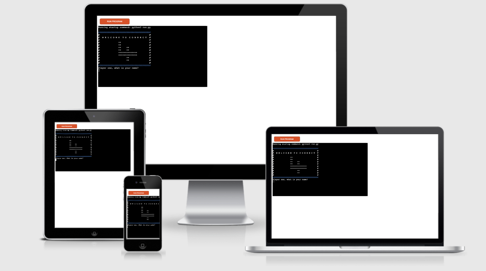

# CONNECT fOUR

[Link to LIVE game](https://connect-four-by-ange.herokuapp.com//)

# 1. Project Goals
Two players to be able to play Connect Four and for there to be one winner. The game is to be played in the Python Terminal and hosted on Heroku. 

The aim of the game is to be the first to get 4 pieces in a row. The pieces can be horizontal, vertical or diagonal. 

##  How to play:
1. Each player enters their name.
2. Player one selects a coloum (0-6) on the board to drop a piece. 
3. The piece will be marked on the board with a "1" or "2" depending on which player's turn it is. 
4. You can not add a piece to a full column. 
5. The players take it in turns to drop their pieces. 
6. The first player to get four in a row wins!!!

[Read more about the physical game](https://en.wikipedia.org/wiki/Connect_Four)

# 2. User Experience

## 2.1 User Stories 
1. As a user, I want to be able to play a digital version of Connect Four. 
2. As a user, I want instructions on how to play the game.
3. As a user, I want to feel excited to play when I start the game.
4. As a user, I need it to be clear whose turn is next. 
5. As a user, I want to celebrate if I win. 
6. As a user, I want the option to restart or quit the game easier when the game is over. 
7. As a user, I want to know if I have made an error and recieve feedback on ho to correct this. 
8. As a user, I want the game to be easy to navigate and play. 
9. As a user, I want to know who has won the game. 

# 3. Features

## 3.1 All features

1. Welcome page:

## Welcomes the players and asks for their names.

2. 
## 3.2 Features to implement:
1. Play agianst the computer
2. Users to recieve a message if the game is a draw. 
3. Score Board. 

# 4. Technologies used 
* [Python](https://en.wikipedia.org/wiki/Python_(programming_language)) - Content and structure
* [Gitpod](https://www.gitpod.io/) - Coding workspace
* [Github/ Github pages](https://github.com/)- Commit my code
* [Am I responsive?](http://ami.responsivedesign.is/#)- To see display the website as mock ups  

# 5. Testing 
 - ### Used [W3C HTML validator](https://validator.w3.org/#validate_by_input) to check Python content.

- ### Validate testing
- ### temrinal and heroku testing

## 6. Deployment

## 7. Credits

## Media

## Acknowledgments:
* My mentor [Precious](https://www.linkedin.com/in/precious-ijege-908a00168/?originalSubdomain=ng) for your help and guidance. 
* [Code Institute](https://codeinstitute.net/) student support, slack community and tutorials. 