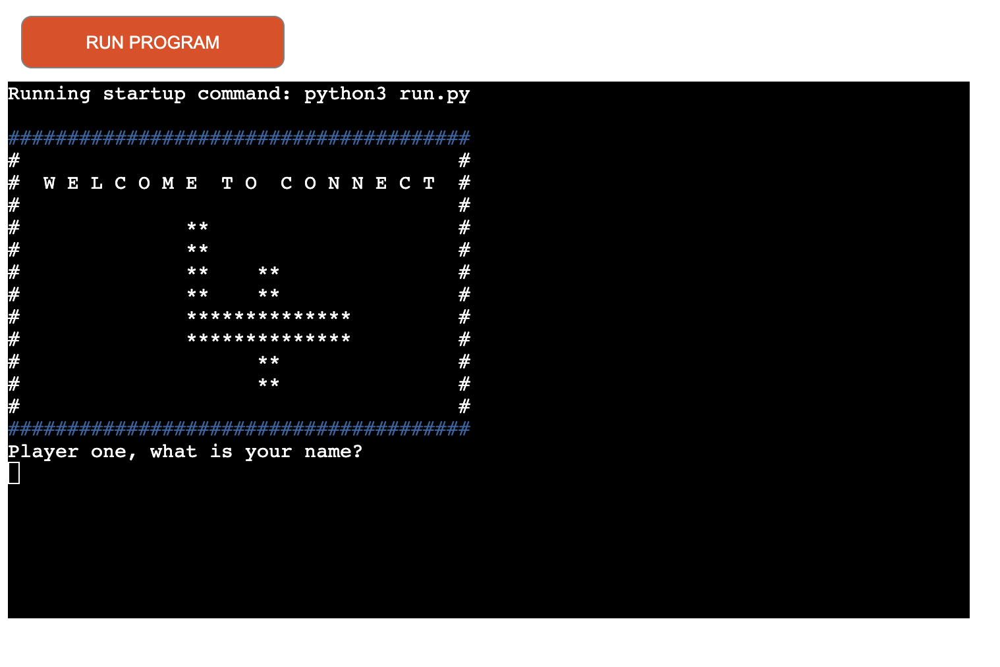
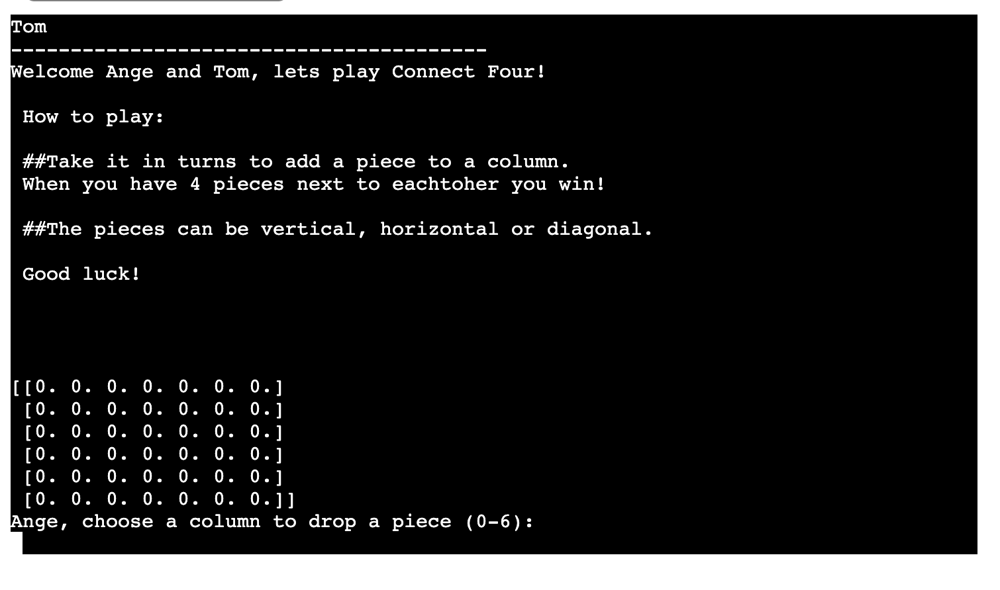
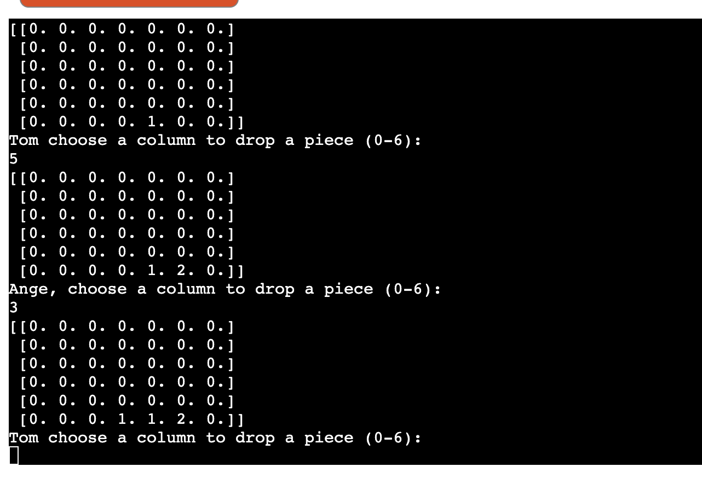
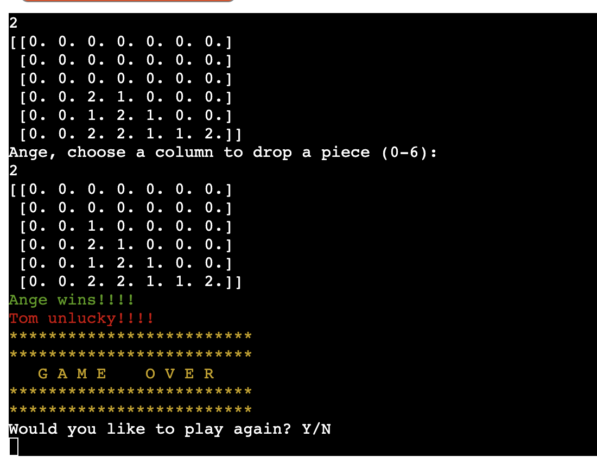
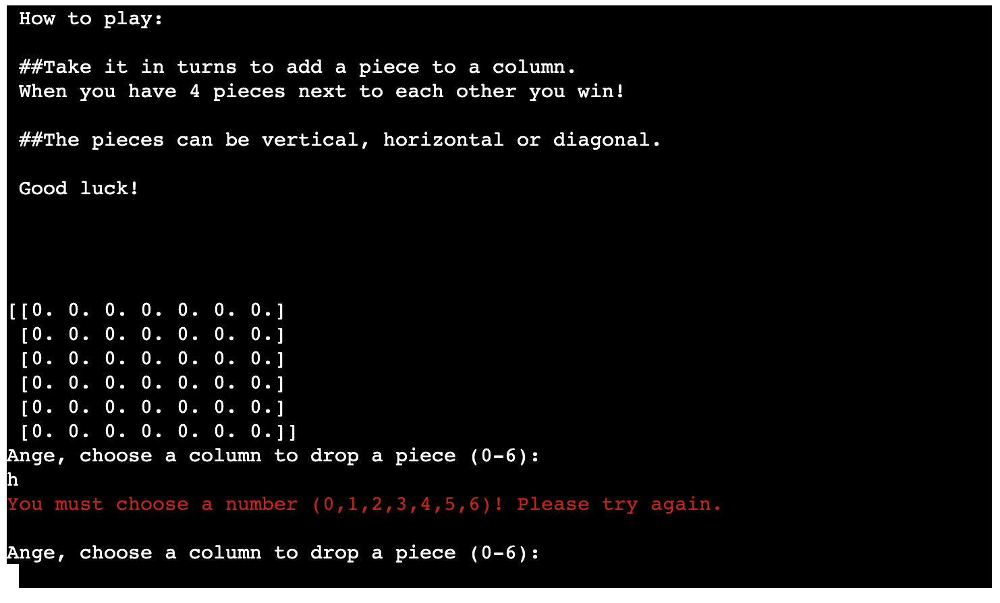

1. **As a user, I want to be able to play a digital version of Connect Four.**

- Users can now play Connect Four online using this Heroku deployed app. 

2. **As a user, I want instructions on how to play the game.**

- The players are given instructions at the beginning of the game. 

3. **As a user, I want to feel excited to play when I start the game.**

- The opening page has this fun layout welcoming the players to the game. 

4. **As a user, I need it to be clear whose turn is next.** 

- The users input their names at the start of the game and then each turn says which player should go. It is simple and clear, therefore does not cause any confusion. 
5. **As a user, I want to celebrate if I win.** 

-  The winner is anounced in green in a celebratory way.
6. **As a user, I want the option to restart or quit the game easily when the game is over.**

- Players can easily choose to restart the game by typing Y and to cancel the game by typing N.
7. **As a user, I want to know if I have made an error and recieve feedback on how to correct this.** 

- Error messages show up for certain in correct inputs. 
8. **As a user, I want the game to be easy to navigate and play.** 
- The game has a great flow and is easy to follow. Users found the game very straightforward to play. 
9. **As a user, I want to know who has won the game.**

- It is very clear when the game is over and who has won the game. 